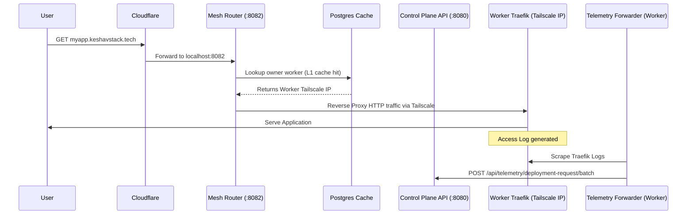

# MeshVPN Edge Routing & Distributed Telemetry

This document outlines the architecture and deployment steps for the Mesh Router and Distributed Telemetry system when running a multi-worker MeshVPN setup.

## The Problem
When deployments are placed on remote worker nodes (instead of just the local control plane), the following issues arise with a naïve setup:
1. **Unreachable Deployments**: Cloudflare Tunnel forwards `*.keshavstack.tech` to the Control Plane's local Traefik. But if a deployment is hosted on `Worker-2`, the Control Plane's Traefik drops the request because it doesn't have the pod locally.
2. **Broken Analytics**: The centralized `traffic-forwarder` only monitors the Control Plane's Traefik logs. Traffic reaching remote workers goes unmonitored.

## The Solution

### 1. Mesh Edge Router (`tools/mesh-router`)
A centralized Go-based reverse proxy that sits in front of the Control Plane.
- Intercepts incoming Cloudflare traffic for user deployments.
- Queries the PostgreSQL database (with an ultra-fast `sync.RWMutex` L1 cache) to find the `owner_worker_id` and the worker's `tailscale_ip`.
- Proxies the HTTP traffic directly to the worker's Traefik ingress over the Tailscale mesh network.

### 2. Distributed Telemetry (`worker-agent/worker-telemetry.yaml`)
Instead of a single `traffic-forwarder`, the forwarder is deployed as a DaemonSet/Deployment on *every* worker cluster.
- Each worker scrapes its *own* local Traefik access logs.
- Pushes batched analytics back to the Control Plane's Telemetry API over the Tailscale network.

---

## 🛠️ Complete Implementation Steps

### A. Control Plane Requirements

1. **Start the Mesh Router**
   The Edge Router must run alongside your Control Plane API, bound to port `8082`.
   ```bash
   ./start-mesh-router.sh
   # Expected output: 🚀 Mesh Router running on :8082
   ```

2. **Update Cloudflare Tunnel Routing**
   In the Cloudflare Zero Trust Dashboard, update your active tunnel's Public Hostnames:
   - Route `api.keshavstack.tech` -> `http://localhost:8080` (Control Plane API)
   - Route `*.keshavstack.tech` -> `http://localhost:8082` (Mesh Edge Router)

### B. Worker Node Requirements

For every worker node joining the mesh:

1. **Join the Tailscale Network**
   The worker must be authenticated to your Tailscale tailnet so the Control Plane can proxy traffic to its `tailscale_ip`.
   ```bash
   sudo tailscale up --authkey=tskey-auth-...
   ```

2. **Run the Worker Agent**
   The worker-agent connects to the Control Plane to execute jobs.
   ```bash
   cd worker-agent
   cp agent.yaml.example agent.yaml
   # Edit agent.yaml with CONTROL_PLANE_URL=http://<CONTROL_PLANE_TAILSCALE_IP>:8080
   go run cmd/worker-agent/main.go --config agent.yaml
   ```

3. **Deploy Distributed Telemetry**
   Apply the telemetry manifests to the worker's local k3s cluster. Open `worker-agent/worker-telemetry.yaml` and update the `CONTROL_PLANE_URL` environment variable to match the Control Plane's Tailscale IP, then apply:
   ```bash
   kubectl apply -f worker-telemetry.yaml
   ```

## Traffic Flow Diagram


